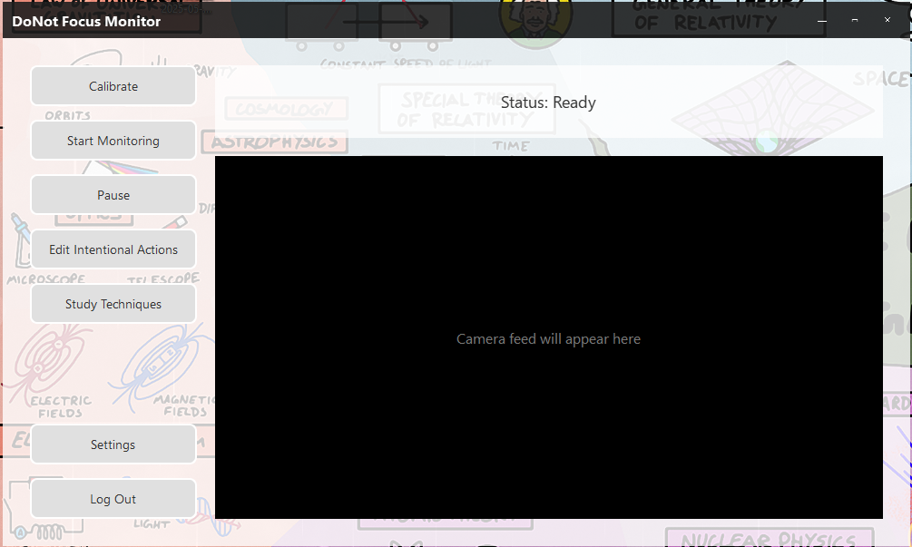
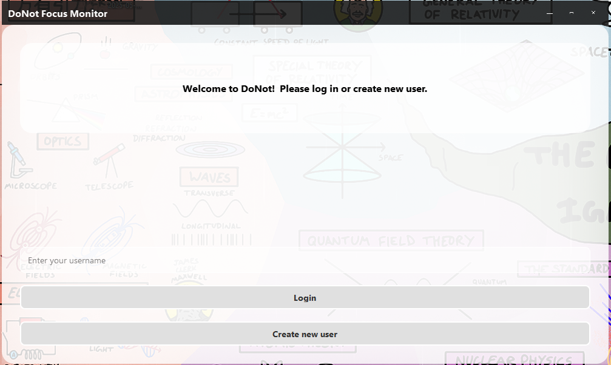
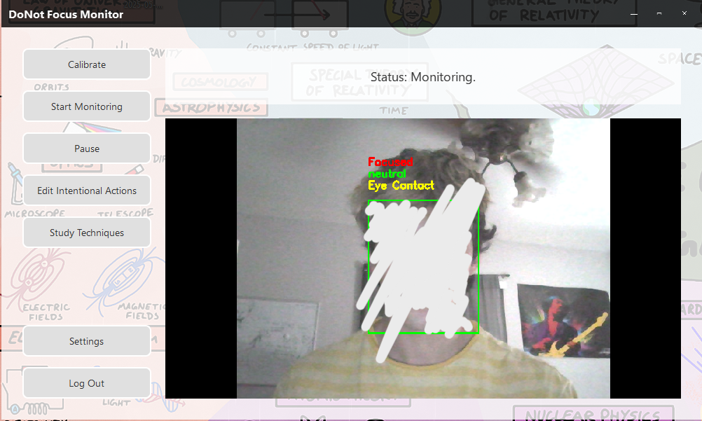
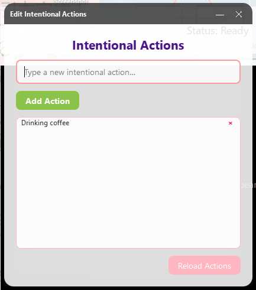
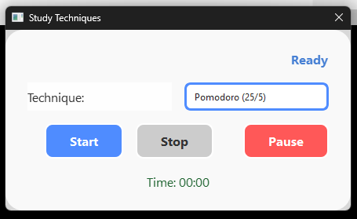
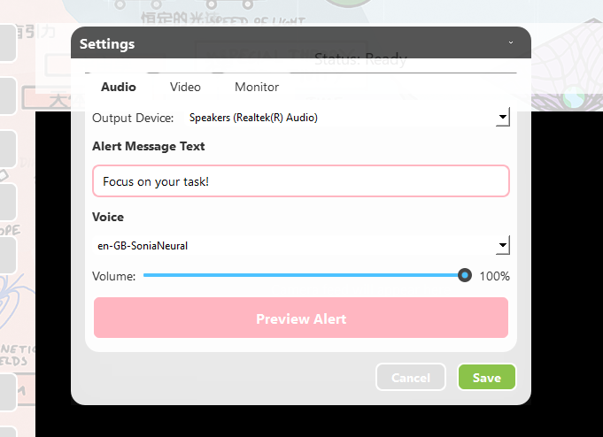
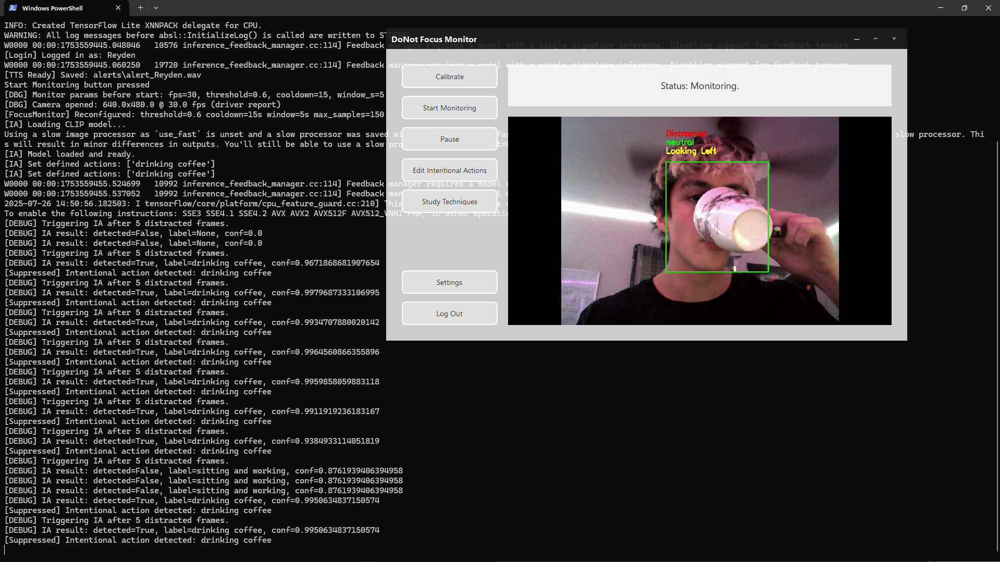

# DoNot: Focus monitor and anti-distraction tool

**DoNot** is an AI-powered focus monitoring and productivity tool that helps you stay on task and study more effectively.  
By using advanced computer vision and language models, DoNot monitors your attention through your webcam, sounding real-time alerts when unintentional distractions are detected.  It features built-in study technique timers and customizable settings.  All user data, including profiles, settings, and calibration information, is saved locally on your computer.

 

---

## Features

- **Real-Time Focus Detection:**  
  Uses state-of-the-art facial analysis to detect distraction, gaze direction, and even emotional state while you work or study.

- **Intentional Action Suppression:**  
  Suppresses distraction alerts when you’re performing user-defined, intentional actions (like drinking coffee, looking at the whiteboard, or checking your phone).

- **Multi-User Profiles:**  
  Supports multiple users with their own settings, intentional actions, and study preferences.

- **Customizable Alerts:**  
  Play custom text-to-speech alert sounds and choose your preferred output device.

- **Productivity Techniques:**  
  Built-in Pomodoro, 52/17, Spaced Repetition, and Custom study timers, with visual and audio reminders.

- **Live Timer & Status Display:**  
  See remaining time and your current status (Study, Break, Review, Paused) at a glance.

---

## Getting Started

### Prerequisites

- Python 3.12 (other versions untested)  
- `PyQt6`, `opencv-python`, `mediapipe`, `numpy`, `tensorflow`  
  *(Install dependencies with `pip install -r requirements.txt`)*

### Running DoNot

1. Clone this repo:
    ```sh
    git clone https://github.com/ReydenRodriguez/DoNotFocusMonitor.git
    cd DoNotFocusMonitor
    ```
2. Install dependencies:
    ```sh
    pip install -r requirements.txt
    ```
3. Launch the application:
    ```sh
    python App.py
    ```
---

## Customization

- **Settings Panel:**  
  - Change video/audio sources, monitor parameters, and study technique options.
  - Adjust camera brightness, contrast, and alert volume.
  - Set and preview your alert sound.
  
- **Intentional Actions:**  
  - Add actions to suppress distraction alerts for activities you define as “intentional.”  
  - **It is important to note that the camera has been horizontally flipped in this application's implementation, so this may affect defined actions**

- **Study Technique Panel:**  
  - Choose a study method and receive reminders in-app.

---

## Settings Overview

The **Settings Panel** in DoNot allows you to customize your monitoring experience across three main tabs:

### Audio

- **Output Device:**  
  Select which audio device will play alert sounds.
- **Alert Message Text:**  
  Set the phrase that will be spoken when an alert is triggered.
- **Voice:**  
  Choose from a list of voices for your alert message.
- **Volume:**  
  Adjust the volume for the alert sound.
- **Preview Alert:**  
  Play a sample of your alert message with your selected settings.

### Video

- **Webcam:**  
  Select which webcam to use if multiple cameras are connected.
- **Brightness, Contrast, Exposure, Saturation:**  
  Adjust these camera settings to improve visibility and tracking accuracy, especially under different lighting conditions.

### Monitor

- **Alert Threshold:**  
  Set how sensitive the system is to distraction (lower values = more sensitive).
- **Cooldown (sec):**  
  Choose how long the system waits before issuing another alert after one is triggered.
- **FPS (Frames Per Second):**  
  Adjust how often the camera is sampled. Higher values are more responsive but use more processing power.
- **Sample Window (sec):**  
  Set the length of time used to calculate distraction statistics for alerting.

---

**All settings are saved per user and persist locally on your computer.**  
This ensures your preferences and calibration data are always available and private.


## Screenshots








